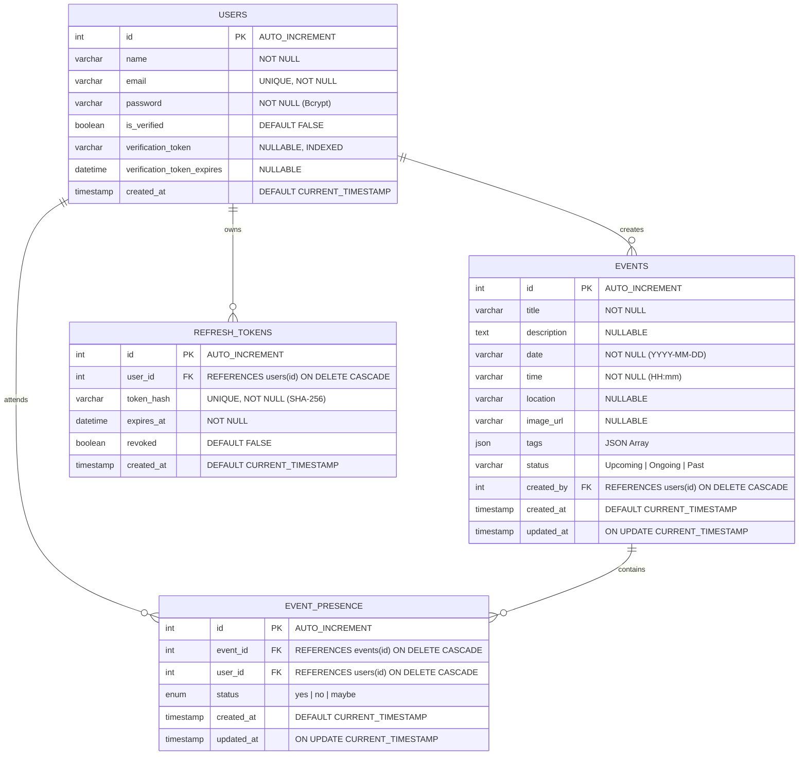

# Evently — Full-Stack Event Planning Platform

A modern, production-grade event planning and management application built with **React 19**, **TypeScript**, **Node.js (Express)**, **MySQL**, and **Knex.js**. Designed with clean architecture, strict TypeScript types, secure authentication, and seamless user experience.

---

## 📑 Table of Contents

1. [Core Features](#-core-features)
2. [Additional & Advanced Features](#-additional--advanced-features)
3. [Engineering Decisions](#1-engineering-decisions)
4. [Setup Instructions](#2-setup-instructions)
5. [Assumptions](#3-assumptions)
6. [API Documentation (Swagger)](#-api-documentation-swagger--openapi-30)
7. [Database Schema](#-database-schema)
8. [Project Structure](#-project-structure)

---

## 🌟 Core Features

### 📅 Events Management
- **Create Events**: Define title, description, date, start time, end time, location, cover image, category tags, and visibility (Public/Private). Includes automatic end-time suggestion (1 hour default) and Cloudinary image optimization.
- **Edit Events**: Event creators can modify any event property. Schedule updates automatically trigger an attendance re-acknowledgment banner for registered attendees.
- **Delete Events**: Event creators can permanently delete their events with cascading removal of linked attendance records.
- **Categorized Event Listings**:
  - **Upcoming Events**: Future events awaiting their start time.
  - **Ongoing Events**: Events currently in progress (with live pulsing status indicator).
  - **Past Events**: Completed events with historical RSVP records.
- **Dynamic Real-Time Status**: Automatically computes `Upcoming`, `Ongoing`, or `Past` based on the current wall-clock time and the event's start/end timings.
- **Single Event Details View**: Comprehensive modal view with high-resolution image banner, complete metadata, host identity, and an attendee list segmented by RSVP response (*Yes*, *Maybe*, *No*).

### 🏷️ Tags & Categories
- **Multi-Tag Assignment**: Assign multiple tags (*Conference*, *Workshop*, *Birthday*, *Meetup*, *Party*, *Tech*, etc.) with preset quick-picks and support for custom user-created tags.
- **Tag Filtering**: Interactive horizontal tag filter with live event counts per tag.
- **Event Visibility Filtering**: Filter between **Public** and **Private** events with visual indicator badges.

### 🔐 Authentication & Authorization
- **User Registration & Login**: Full auth flow with client and server validations.
- **Secure Password Hashing**: Passwords hashed with `bcryptjs` using 10 salt rounds.
- **JWT Authentication**: Short-lived Access Tokens (15 min) delivered via secure `httpOnly`, `SameSite` cookies and compatible `Authorization: Bearer <token>` headers.
- **Strict Creator Authorization**: Server-side validation ensures only the original event creator (`created_by === currentUserId`) can edit or delete an event (`403 Forbidden` for unauthorized attempts). Frontend conditionally restricts edit/delete controls to the creator.

---

## 🚀 Additional & Advanced Features

### 🤝 RSVP & Presence System
- **Three-State Attendance**: Attendees can RSVP with **Yes** (*Attending*), **Maybe** (*Tentative*), or **No** (*Declined*).
- **Attendee Breakdown**: View real-time attendee names and emails categorized by their response.
- **Schedule Change Acknowledgment**: If an organizer updates an event's date or time after a user has RSVP'd, the user receives an alert prompting them to re-confirm their attendance for the new schedule.

### 🔄 Advanced Session & Token Management
- **Refresh Token Rotation**: Long-lived refresh tokens (7 days) stored securely in MySQL as SHA-256 hashes. Rotating token pairs on every refresh request.
- **Token Reuse Detection**: If an invalidated refresh token is presented, the entire family of tokens is revoked to protect against session hijacking.
- **Silent Background Refresh**: Frontend `fetchWithAuth` wrapper automatically catches `401 Unauthorized` responses, transparently acquires a new access token, and retries the failed request without disrupting the user.

### ✉️ Email Verification
- **Automated Verification Dispatch**: Sends verification emails via the Resend API upon registration.
- **Login Guard**: Unverified accounts are prevented from logging in (`403 EMAIL_NOT_VERIFIED`).
- **Dedicated Verification Page**: Interactive `/verify-email` page handling token validation and one-click resend requests.
- **Developer Local Mode**: When `RESEND_API_KEY` is not configured, the verification link is logged directly to the server console for immediate one-click testing.

### 🔎 Levenshtein Fuzzy Search Engine
- Typo-tolerant fuzzy search matching queries across **Title**, **Location**, **Description**, and **Tags**.
- Dynamic Levenshtein distance thresholding based on token length with composite relevance scoring.

### 📊 Server-Side Pagination & Multi-Criteria Sorting
- **Configurable Pagination**: Supports `page` and `limit` query parameters with complete pagination metadata (`totalPages`, `hasNextPage`, `hasPrevPage`).
- **Sorting Options**:
  - Event Time Ascending (`event_time_asc`)
  - Event Time Descending (`event_time_desc`)
  - Popularity (`popularity` — ordered by number of confirmed *Yes* RSVPs)
  - Creation Time (`creation_time` — newest events first)

### 🛡️ Security & Performance
- **Brute-Force Rate Limiting**: `express-rate-limit` safeguards login, registration, token refresh, and email resend endpoints.
- **Security Headers**: `helmet` configured with hardened HTTP response headers.
- **CORS Configuration**: Restricts access to explicitly allowed browser origins.
- **Structured Backend Logging**: Colored, leveled (`DEBUG`, `HTTP`, `INFO`, `WARN`, `ERROR`), timestamped logger with sensitive field redaction (`password`, `token`, `cookie`) and unique `x-request-id` tracing.
- **Cloudinary Image Optimization**: Auto-formats, compresses, and scales event cover images.
- **Offline Resilience**: Frontend API client automatically synchronizes with `localStorage` to ensure the application remains functional even during brief server interruptions.

---

## 1. Engineering Decisions

### Architectural Overview
The system follows a **layered, decoupled client-server architecture**:
- **Presentation Layer (Frontend)**: React 19 single-page application built with Vite and TypeScript. Manages local UI state, cached data, and responsive layout.
- **API Layer (Backend)**: RESTful Express service written in TypeScript. Follows a strict pipeline:
  Request -> Request Logger -> Rate Limiter -> Auth Middleware -> Validator -> Controller -> Knex/MySQL -> Response
- **Data Layer (Database)**: Normalized MySQL relational database managed via Knex.js migrations.

### Key Technology Choices

| Decision | Chosen Technology | Rationale |
| :--- | :--- | :--- |
| **Frontend Framework** | **React 19 + TypeScript + Vite** | Provides instant HMR during development, strict type safety across shared domain models, and zero bundle bloat. |
| **Styling** | **Tailwind CSS v4** | Utility-first CSS provides a consistent design system, eliminates unused CSS overhead, and simplifies responsive styling. |
| **Backend Runtime** | **Node.js (Express + TypeScript)** | Lightweight, non-blocking I/O ideal for concurrent API traffic. Strong typing ensures contract alignment between API payloads and database models. |
| **Query Builder vs. ORM** | **Knex.js (Zero ORMs)** | Selected over heavy ORMs (TypeORM/Prisma) to retain full transparency over executed SQL queries, avoid unexpected N+1 performance bottlenecks, and execute optimized joins (`LEFT JOIN event_presence`) and aggregations with complete control. |
| **Database** | **MySQL (Relational)** | Enforces ACID guarantees, relational integrity via foreign keys (`ON DELETE CASCADE`), and composite unique constraints (`(event_id, user_id)`). |
| **Authentication Strategy** | **Dual JWT (Cookies + Bearer)** | Web clients authenticate using secure `httpOnly`, `SameSite=Lax` cookies to prevent XSS credential theft, while Swagger UI and third-party consumers can use standard `Authorization: Bearer <token>` headers. |
| **Real-Time Status Computation** | **Dynamic Date Evaluation** | Rather than relying on cron jobs to mutate database statuses every minute, event status (`Upcoming`, `Ongoing`, `Past`) is dynamically derived from real-time timestamps in both SQL queries and client state. |

---

## 2. Setup Instructions

### Prerequisites
- **Node.js**: v18.0.0 or higher
- **npm**: v9.0.0 or higher
- **MySQL**: 8.0 or higher running locally

---

### Step 1: Clone Repository
```bash
git clone https://github.com/anoopghm/Event_Planning.git
cd Event_Planning
```

---

### Step 2: Database Setup
1. Start your local MySQL service.
2. Open your MySQL client and create the database:
```sql
CREATE DATABASE event CHARACTER SET utf8mb4 COLLATE utf8mb4_unicode_ci;
```

---

### Step 3: Backend Setup
1. Navigate to the backend directory:
```bash
cd backend
```

2. Install dependencies:
```bash
npm install
```

3. Configure environment variables:
```bash
cp .env.example .env
```
Edit `.env` with your MySQL credentials and a secure secret:
```env
PORT=4000
DB_HOST=localhost
DB_PORT=3306
DB_USER=root
DB_PASSWORD=your_mysql_password
DB_NAME=event
JWT_SECRET=your_super_secret_jwt_key_at_least_32_characters
JWT_ACCESS_EXPIRES_IN=15m
JWT_REFRESH_EXPIRES_IN=7d
CORS_ORIGIN=http://localhost:5173

# Optional: Email Verification via Resend (defaults to console logging if omitted)
RESEND_API_KEY=re_your_api_key_here
EMAIL_FROM=Evently <onboarding@resend.dev>
APP_URL=http://localhost:5173
```

4. Run database migrations:
```bash
npm run migrate:latest
```
*(Note: Migrations also run automatically on server start).*

5. Start the backend development server:
```bash
npm run dev
```
The backend API will be live at `http://localhost:4000`.

---

### Step 4: Frontend Setup
1. Open a new terminal and navigate to the `Frontend` directory:
```bash
cd Frontend
```

2. Install dependencies:
```bash
npm install
```

3. Start the Vite dev server:
```bash
npm run dev
```
The frontend application will be live at `http://localhost:5173`.

---

## 3. Assumptions

During the design and implementation of this system, the following assumptions were made:

1. **Date & Time Standards**:
   - Dates are stored in ISO `YYYY-MM-DD` format and times in 24-hour `HH:mm` format.
   - Real-time status computations assume the client and server operate in synchronized wall-clock time.
2. **Event Visibility Permissions**:
   - **Public Events**: Discoverable by any authenticated user on the main dashboard.
   - **Private Events**: Visible to the creator and users interacting directly with the event.
3. **RSVP Lifecycle**:
   - Any authenticated and verified user can submit and change their RSVP response (*Yes*, *Maybe*, *No*) at any point.
   - If an organizer modifies an event's date or start/end time, registered attendees are prompted to re-acknowledge the schedule.
4. **Creator Authorization Boundary**:
   - Only the user whose `id` matches `event.created_by` possesses permissions to update or delete the event.
5. **Email Delivery Environment**:
   - In production, email verification requires an active Resend API key with a verified sending domain.
   - In development/sandbox environments, verification links are printed directly to the backend terminal log to allow seamless local testing without external email dependencies.
6. **Image Handling**:
   - Cover images are provided as external image URLs (e.g., Unsplash, Cloudinary). URLs are automatically transformed through Cloudinary's dynamic optimization parameter pipeline.

---

## 📖 API Documentation (Swagger / OpenAPI 3.0)

Interactive API documentation powered by Swagger UI is built into the backend.

- **Swagger UI Interactive Explorer**: [http://localhost:4000/docs](http://localhost:4000/docs)
- **Raw OpenAPI 3.0 JSON Spec**: [http://localhost:4000/api/docs.json](http://localhost:4000/api/docs.json)

### Key Endpoints

| Method | Endpoint | Access | Description |
| :--- | :--- | :--- | :--- |
| `POST` | `/api/auth/register` | Public | Register a new user account |
| `POST` | `/api/auth/login` | Public | Authenticate user & receive tokens |
| `POST` | `/api/auth/refresh` | Public | Rotate refresh token & get fresh access token |
| `POST` | `/api/auth/logout` | Public / Auth | Revoke refresh token & clear cookies |
| `GET` | `/api/auth/verify-email` | Public | Verify email address using token |
| `POST` | `/api/auth/resend-verification` | Public | Resend verification email |
| `GET` | `/api/auth/me` | Authenticated | Get current authenticated user session |
| `GET` | `/api/events` | Public / Opt Auth | List paginated events (supports search, tag, status, sort) |
| `POST` | `/api/events` | Authenticated | Create a new event |
| `GET` | `/api/events/:id` | Public / Opt Auth | Retrieve single event details with attendees |
| `PUT` | `/api/events/:id` | Creator Only | Update existing event |
| `DELETE` | `/api/events/:id` | Creator Only | Delete event |
| `POST` | `/api/events/:id/rsvp` | Authenticated | Submit or update attendance RSVP (`yes`, `no`, `maybe`) |
| `GET` | `/api/events/:id/rsvp` | Public | View attendee presence breakdown |

---

## 🗄️ Database Schema



---

## Project Structure

```
Event_Planning/
├── backend/
│   ├── src/
│   │   ├── controllers/
│   │   │   ├── authController.ts       # Auth, session, verification logic
│   │   │   └── eventController.ts      # Events CRUD, presence, search, filtering
│   │   ├── docs/
│   │   │   └── swagger.ts             # OpenAPI 3.0 specification & UI setup
│   │   ├── middleware/
│   │   │   ├── auth.ts                # requireAuth & optionalAuth JWT guards
│   │   │   ├── cookies.ts             # Cookie extraction & parsing
│   │   │   ├── errors.ts              # Global error handler (MySQL code mapping)
│   │   │   └── validate.ts            # express-validator response formatter
│   │   ├── migrations/                # Knex schema versioning scripts
│   │   ├── models/
│   │   │   ├── db.ts                  # Knex connection pool configuration
│   │   │   └── initDb.ts              # Automatic startup migration runner
│   │   ├── routes/
│   │   │   ├── auth.ts                # Authentication endpoints & rules
│   │   │   └── events.ts              # Event endpoints & validation rules
│   │   ├── utils/
│   │   │   ├── AppError.ts            # Custom operational error class
│   │   │   ├── cloudinary.ts          # CDN image URL optimization
│   │   │   ├── email.ts               # Resend verification mail dispatch
│   │   │   ├── jwt.ts                 # Access & Refresh token utilities
│   │   │   ├── logger.ts              # Leveled & sanitized console logger
│   │   │   └── searchUtils.ts         # Levenshtein distance fuzzy search
│   │   ├── app.ts                     # Express app, helmet, CORS, rate limits
│   │   └── server.ts                  # HTTP server lifecycle & graceful shutdown
│   ├── knexfile.ts                    # Knex configuration file
│   ├── package.json
│   └── tsconfig.json
│
├── Frontend/
│   ├── src/
│   │   ├── components/
│   │   │   ├── auth/                  # Auth form & validation components
│   │   │   ├── dashboard/             # Dashboard overview, stats, my-events
│   │   │   ├── events/                # Event card, details modal, create modal
│   │   │   ├── layout/                # Navbar & responsive navigation drawer
│   │   │   ├── routes/                # ProtectedRoute & PublicOnlyRoute guards
│   │   │   └── ui/                    # Reusable Button, Input, Modal components
│   │   ├── pages/
│   │   │   ├── Dashboard.tsx          # Main event workspace & filters
│   │   │   ├── Login.tsx              # User sign-in page
│   │   │   ├── Signup.tsx             # User registration page
│   │   │   └── VerifyEmail.tsx        # Email activation landing page
│   │   ├── utils/
│   │   │   ├── apiClient.ts           # Fetch wrapper with silent token refresh
│   │   │   ├── eventApi.ts            # Event API client with localStorage sync
│   │   │   ├── eventUtils.ts          # Time formatting & status computation
│   │   │   ├── searchUtils.ts         # Client-side fuzzy search
│   │   │   └── sortUtils.ts           # Sorting algorithms
│   │   ├── types/                     # Shared TypeScript interfaces
│   │   ├── App.tsx                    # React Router configuration
│   │   └── main.tsx                   # React application entry point
│   ├── package.json
│   ├── vite.config.ts                 # Vite setup with Tailwind & API proxy
│   └── tsconfig.json
│
└── README.md                          # Comprehensive project documentation
```
